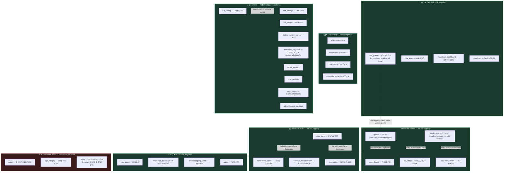

# XOS — Staff UI/UX Intelligence Audit + EZGO Mail Sync Review
> Stage 0+1 research audit — **no code written**. Companion to `RESORT_UI_MANIFEST.md` (design intent) and `docs/active_sprint.md` (delivery history). Produced 2026-08-02 by mapping the live codebase (three parallel read-only research passes over `src/App.js`, `src/utils/auth.js`, `WhatsAppInbox.js`, `AutomationControlCenter.js`, `GuestsPage.js`, `RoomBoard.js`, `OperationsBoard.js`, `DataSyncPage.js`, `EzgoMailSyncPanel.js`, and the EZGO mail-sync Edge Functions) — every claim below is file:line-cited to that pass, not inferred from memory.

---

## 1. Executive Summary

1. **אין רכיב Toast/Banner משותף** — 44 מימושים מקומיים נפרדים ב-41 קבצים, כל אחד מעוצב קצת אחרת (אפילו המיקום על המסך שונה: `RoomBoard.js` מציג למעלה-ימין, כל השאר למעלה-מרכז).
2. **שלושה מסכי "רשימת אורחים" נפרדים** (`vip_guests`/`guests`/`suites`) עם 3 שאילתות DB שונות לגמרי — ומסלול `suites` מיותם לחלוטין (0 קישורים בקוד, לא בסיידבר ולא ב-deep-link).
3. **שלושה מימושים עצמאיים של "שליחת חדר מוכן"** (`GuestDashboard`/`GuestsPage`/`SuitesDashboard`) שכולם קוראים לאותה Edge Function בנפרד — כפילות שמגדילה סיכון לאי-עקביות (בדיוק סוג הבאג שכבר גרם לתקריות תור-חוזר בעבר לפי `CLAUDE.md`).
4. **4 מסכים "מתים"**, נגישים רק ב-deep-link ידני — `spa_staging`, `suites` (כבר מתועדים) **וגם** `tasks`/`calls` (לא היו מתועדים) — קוד ישן שלא הוסר אחרי מיזוגים קודמים.
5. **Cmd+K מכיר רק 4 מתוך כ-30 מסכים**, וחיפוש אורח תמיד "נוחת" ב-Inbox בלבד — לא עוזר למצוא מסכים אחרים.
6. **`WhatsAppInbox.js` (7,497 שורות) — המסך הכי כבד באפליקציה**: 3 מימושים שונים לבורר ערוץ Meta/Whapi, אותו Toast מוצג פעמיים בו-זמנית במובייל, 216 צבעי hex קשיחים.
7. **`AutomationControlCenter.js` (7 טאבים, המסך המורכב ביותר)** — בלי Realtime ובלי Polling בכלל למרות המיתוג "תור חי"; וגם בו — 4 מימושים שונים לבורר ערוץ.
8. **`RoomBoard.js` הוא המסך היחיד עם Realtime "פתוח" תמיד** (לא מכובה כשהטאב לא פעיל) — מפר את עקרון "אין רעש רקע" (`RESORT_UI_MANIFEST.md` §1.2).
9. **ה-Bottom Bar במובייל הוא רשימה קשיחה שלא מכבדת הרשאות תפקיד** — למשל צוות ספא רואה שם טאבים שהוסתרו במכוון מהתפריט הרגיל שלהם.
10. **סנכרון מייל EZGO ברקע כנראה כבוי כרגע** (`EZGO_MAIL_BACKGROUND_SYNC` לא מוגדר ב-secrets) — כל הסריקות היום הן ידניות בפועל, למרות שהתשתית ל"אוטומטי" כבר בנויה ועובדת.

**אם מתקנים רק 3 דברים:**
1. רכיב Toast/Banner משותף אחד לכל האפליקציה — מאמץ קטן, "הרגשת רוגע" מיידית בכל מסך.
2. להפעיל/לוודא את הסנכרון האוטומטי של EZGO + לצרף שורת "חסר דוח כניסות" לדוח הבוקר שמייק כבר קורא — הכי קרוב ל"סנכרון חכם" באמת, בלי כמעט קוד חדש.
3. לאחד את 3 המימושים של "שליחת חדר מוכן" ואת 4-3 המימושים של בורר הערוץ — מפחית בדיוק את סוג הבאג שכבר עלה בעבר (ניתוב לא עקבי, שגיאות כפולות).

---

## 2. Information Architecture Map

**Current structure** (`src/App.js:1373-1557`) is flat: one `allNavItems` array (21 ids) + one visually-separated but structurally-identical admin block (11 ids) + a hardcoded 5-item mobile bar (`App.js:2588-2594`) that does **not** run through the same role filter as desktop (`App.js:2717-2752` — plain `.map()`, no `canSeeNavItem` call).

**Reading the diagram:** solid arrows = confirmed navigation/dependency (`dashboard`'s urgent-banner actions all terminate in `ops_board`/`requests_board`, per `OperationalDashboard.js:158-206`). Dotted arrows = overlap/duplication findings, not navigation. Nothing here proposes deleting a route — it proposes **visual regrouping only** (Phase 1) plus flagging the orphan cluster for Mike's explicit per-route decision.

---

## 3. Persona Journey Tables

### Receptionist

| Task | Current path (clicks) | Friction | Proposed path | Priority |
|---|---|---|---|---|
| Guest asks on WhatsApp if room is ready | 1 screen (`wa_inbox`), 2–4 clicks — open thread → optional profile drawer → quick-action send (`WhatsAppInbox.js:6868-6929`) | Low — already efficient | No change | P2 |
| New arrival ETA comes in | Passive: 1 click (floating `RequestsAlertWidget` FAB, page-independent, `App.js:2761`). Active check: 2 *separate, non-cross-linked* surfaces — `requests_board` filter or `GuestsPage`'s collapsed-by-default ETA board (`GuestsPage.js:901-920`) | ETA badge never appears on the Inbox roster itself (confirmed zero references) despite Inbox being where reception spends most of the day; two surfaces show the same fact with no link between them | Surface an ETA badge directly on the Inbox roster row using the existing `guest_alerts` data — no new data model needed | **P1** |
| Check today's/tomorrow's EZGO arrivals were captured | 1 screen (`data_sync` → מייל EZGO tab), then N clicks — 1 per ingest line even for 100%-confidence matches (`EzgoMailSyncPanel.js:485`) | Per-line approval loop has no confidence tiering; ledger banner (`:308-316`) only visible if this specific tab is opened | See EZGO Blueprint §5 — push the gap-check into a digest already read daily; tier high-confidence lines | **P1** |
| Respond to a red-dot (`human_requested`) alert | 1 screen (`wa_inbox`), roster already sorts/filters for this (`otherAudienceWaiting` banner, `WhatsAppInbox.js:5750-5776`) | Low — already efficient | No change | P2 |
| "Where do I go to do X" (general) | Cmd+K only indexes 4 routes (`GlobalCommandPalette.js:49-54`) out of ~30 | Command palette is effectively useless for anything except Inbox/Check-in/Guest-management/Automation | Derive palette's nav list from the same role-filtered `allNavItems` the sidebar already uses | **P1** |

### Front Desk Manager

| Task | Current path (clicks) | Friction | Proposed path | Priority |
|---|---|---|---|---|
| Approve a pending housekeeping task | 1–2 screens (`ops_board` directly, or via `dashboard`'s urgent banner), auto-selects the pending-approval tab (`OperationsBoard.js:637`), 1–2 clicks | Low — already efficient | No change | P2 |
| Resend a missed Stage-1 automation (`missed_window`) | 1 screen (`automation_center` → תור חי tab), 2 clicks + confirm modal (`AutomationControlCenter.js:414-447`) | Moderate — findable only if the manager already knows `automation_center` is the right place; not linked from the dashboard's urgent banner for this specific case | Add a `missed_window` count to the dashboard urgent banner alongside the existing pending/complaint/ETA counts | P2 |
| Decide where to edit hotel operating hours | 2 *independently editable* places for the same fact — structured field in `BotConfigPanel` (`category='knowledge'`) vs. free text in `BotSettings.knowledge_base`, with a **runtime conflict-detector** that explicitly warns when they disagree (`BotSettings.js:547-568`) | High — this is a live drift risk, not just a UX nuisance; the bot itself can give inconsistent answers depending on which source "wins" | Single source of truth: keep the structured `bot_config` fields as canonical, remove the ability to also express hours in free text, delete the conflict-detector once structurally impossible | **P1** |
| Find the spa-activities importer | 2 independent mount points for the same component — `DataSyncPage.js:7,68` and `SpaBoard.js:13,1759` (the former's own copy even says *"full management lives in SpaBoard"*) | Low-moderate — works either way, but doubles maintenance surface and risks the two copies drifting in behavior | Keep the import UI at `SpaBoard` only; `data_sync` links to it instead of re-embedding | P2 |

---

## 4. Clutter & Cognitive Load Scorecard

| Screen | Load (1–5) | Root cause | Specific fix (no code) | Effort |
|---|---|---|---|---|
| `WhatsAppInbox.js` | **5** | 7,497 lines; 13+ distinct toast/banner types; 3 independently-coded channel-selector UIs (`NewChatModal` button-pair, thread-header `replyChannel` toggle, `ChannelMuteButton`); `routeToast` rendered in 2 DOM locations simultaneously on mobile (`:6800`, `:7397`); 216 raw hex colors, 349 inline `style={{}}` blocks — largest drift of any file audited | Extract one shared `<ChannelPicker>` used by all 3 sites; collapse `routeToast` to a single render location; migrate hex → CSS vars incrementally | **L** |
| `AutomationControlCenter.js` | **4** | 4,592 lines, 7 tabs; branded "📡 תור חי" (Live Queue) but has **zero** realtime subscription and **zero** polling anywhere in the file (confirmed by grep) — all data is manual-refresh-on-tab-switch; 4 separately-implemented channel-selector patterns in one file | Same shared `<ChannelPicker>`; either wire a gated realtime channel into the Queue tab or rename it to stop implying live-push behavior it doesn't have | **M** |
| `GuestsPage.js` | **3** | 1,227 lines; desktop table (`:991-1127`) and mobile card list (`:1129-1223`) are two **parallel, independently-written** render trees duplicating nearly all per-row logic (badges, conflict warnings, actions); realtime channel uses a hand-rolled visibility check instead of the shared `usePageVisibility` hook the file already imports | Extract one shared `<GuestRow>` component consumed by both layouts; switch the hand-rolled visibility gate to `usePageVisibility` | **M** |
| `RoomBoard.js` | **2** | Otherwise clean (1 toast, reasonable filter count) but its realtime channel (`:253-262`) has **no visibility gate at all** — the only one of the 5 audited high-traffic screens in this state; also duplicates its own filter control (stat-tile clicks and filter chips both drive the same `filter` state, `:594-645`) | Wire `usePageVisibility`; keep one filter control, not two | **S** |
| `OperationsBoard.js` | **2** | Reference baseline — single toast, one filter dimension, gated realtime. No action needed here; used as the comparison point for the fixes above | — | — |
| `DataSyncPage.js` / `EzgoMailSyncPanel.js` | **4** | 1,221-line panel; 2 independent toast states declared in `DataSyncPage.js` alone; strictly per-line approval with no confidence tiering; `ActivitiesImportZone`/`ArrivalImportPanel` each duplicated into another screen (see IA map) | Covered in EZGO Blueprint (§5) + IA regroup (Phase 1) | **M–L** |
| Admin cluster (as a group) | **3** | Not any single screen's fault — boundary blur *between* `BotConfigPanel`/`BotSettings` (hotel hours) and a 3-way duplicate Meta-template UI across `BotScriptEditor`/`AutomationControlCenter`/`BroadcastDashboard` (the latter is already correctly shared via `TemplateManagerPanel.js` — good existing pattern, not a new fix) | Resolve hotel-hours dual-source (see Manager table above); no action needed on the already-shared template panel | **S–M** |
| Command Palette | n/a (coverage gap) | Hardcoded 4-item nav list (`GlobalCommandPalette.js:49-54`) never updated as the sidebar grew to ~30 routes | Derive from the same role-filtered nav arrays the Sidebar already computes | **S** |
| Toast/Banner system (cross-cutting) | n/a (systemic) | 44 separate local implementations across 41 files; even positioning is inconsistent (`RoomBoard.js` top-right vs. everyone else top-center) | Extract one shared `<Toast>`/`useToast()` — `PortalSettingsPanel.js:18,32` already privately built almost exactly this, just never exported/reused | **M** (touches many files, zero logic risk — pure visual consolidation) |
| Mobile bottom bar | n/a (correctness, not load) | Hardcoded 5-item list (`App.js:2588-2594`) rendered without `canSeeNavItem`/`filterNavItemsForUser` — a spa-department receptionist sees `vip_guests`/`agent` tabs on mobile that are deliberately hidden from their desktop sidebar | Route `mobileNav` through the same role-filter pipeline as desktop | **S** |

---

## 5. EZGO Mail Sync — Smart Sync Blueprint

### Current behavior (cited)

- **Cron cadence:** `whatsapp-cron` fires every 15 min (`supabase/migrations/007_whatsapp_cron.sql:19-29`). Whether it actually calls `ezgo-mail-sync` depends on **4 independent gates** in `shouldInvokeEzgoMailFromCron` (`_shared/ezgoMailImap.ts:187-201`): master enable flag, a *separate* `EZGO_MAIL_BACKGROUND_SYNC` opt-in, Israel business hours (07–20 default), and a minimum 2h gap since the **last run of any kind**.
- **Live-state finding:** `EZGO_MAIL_BACKGROUND_SYNC` does not appear in the current `supabase secrets list` output at all — read as `false` with no default-true fallback (`ezgoMailImap.ts:153-155`). Under the currently configured secrets, **the automatic background path never fires** — every ingest today plausibly originates from a manual scan, full scan, or `.eml` upload.
- **Throttle coupling:** the same `cron_heartbeats` row is upserted after *every* invocation regardless of trigger source (`ezgo-mail-sync/index.ts:143-155`) — a staff member's manual "🔄 סרוק מייל עכשיו" click resets the 2-hour timer that gates the *next automatic* cron attempt.
- **IMAP query plan:** primary path is a combined, allowlist-wide O(1) plan (2–3 native IMAP queries total, `buildCombinedAllowlistSearchPlan`, `ezgoMailImap.ts:744-781`) — the old per-sender loop only runs as a fallback when the combined plan finds **zero** UIDs (`:923-966`).
- **Dedup:** normalized RFC Message-ID header, cheap envelope-only pre-check before downloading full source (`fetchMessagesByUidList`, `:1052-1112`), backstopped by a hard DB `UNIQUE(external_message_id)` constraint (`migrations/267_ezgo_mail_sync.sql:23`).
- **Report-type detection:** attachment-first (CSV → Doc2), then HTML/text classification checking Doc2 markers *before* Doc1 (`ezgoDoc1Parser.ts:508-528`). Every unrecognized or zero-row email is still inserted with a visible `parse_status='skipped'|'failed'` row and an explanatory `parse_error` — nothing is silently dropped (honors Zero Data Loss).
- **Ledger banner:** purely client-side, computed only while the מייל EZGO tab is open, from the last 50 loaded rows (`EzgoMailSyncPanel.js:308-316`). No other surface in the app reads this signal — confirmed by grep, no digest/dashboard/badge references it.
- **Approval:** every line starts `pending_review`; nothing auto-applies on ingest. Batch-apply exists but is scoped to the currently-open ingest and, outside a few enrich/room-assign sections, restricted to exact `match_method==='order'` lines (`EzgoMailSyncPanel.js:815-837`) — still one explicit click.
- **Toast legibility:** distinguishes "already synced, nothing new" (green) from "genuinely found nothing" (red, `EzgoMailSyncPanel.js:342-404`), and surfaces raw IMAP diagnostic counters — but any `searchErrors` entry appends raw Deno/IMAP exception text (e.g. `MissingServerExtension`) with no Hebrew plain-language translation.
- **Retention:** `purge_stale_ezgo_mail_ingest` (default 3 days) hard-guards against ever deleting a row with a `pending_review` line (`migrations/271_ezgo_mail_retention.sql:19-25`) — safe by construction.

### Gaps

1. The one thing that would make this feel "smart" — mail arriving with zero clicks — is currently not actually running, and **nothing in the UI tells Mike that** (a config-level Fail-Visible violation, even though the code itself is fine).
2. The ledger banner is invisible unless someone remembers to open this specific tab; a day EZGO simply doesn't send mail is indistinguishable from a day nobody checked.
3. The banner also can't distinguish "nothing arrived" from "arrived but failed to parse" — the failed row is sitting right there in the same ingest list, unreferenced.
4. Zero confidence tiering on approval — a 100%-confidence order-number+phone+name match takes exactly as many clicks as an ambiguous one.
5. Manual scans quietly suppress the next automatic tick (throttle-timer coupling).
6. Raw IMAP error strings aren't translated for a non-technical reader.

### Three architectural options

**Option A — Fix the automatic path + push the gap forward** *(lowest effort/risk)*
Confirm/enable `EZGO_MAIL_BACKGROUND_SYNC`; decouple the cron throttle from manual-scan timestamps (track `last_cron_run` separately from `last_manual_run`); add the "missing today/tomorrow's Doc2" check as one line in a digest Mike already reads (front-desk morning brief or Eliad's morning pulse), with a deep link into the filtered ingest view.
*Risk: low* — config + one digest line, no write-path changes.

**Option B — Confidence-tiered auto-apply** *(medium effort, changes write behavior)*
For the tier the matching engine already computes as `match_method==='order'` (exact booking-number match, no conflicting existing data) — offer a scoped "אשר הכל בביטחון גבוה" batch action, or auto-apply that exact tier with a visible "auto-applied — לבדיקה" flag staff can review/undo.
*Risk: medium* — this is a Golden Profile write path; must stay provably conservative (the tier already exists in code) and remain undoable — never silent.

**Option C — Inbox-zero queue + cross-page push notification** *(highest effort, most "smart"-feeling)*
Reuse the existing page-independent `RequestsAlertWidget` FAB pattern to surface a new-ingest signal from any screen, not just when `data_sync` is open; reframe the panel around "what needs a decision across all ingests" rather than "which email did I get, drill into it."
*Risk: medium-high* — larger surface area on an already-1,221-line file; more testing.

**Recommended sequencing:** **A now → B as a fast-follow → C only if A+B still don't feel like enough.** A is nearly all configuration plus a two-line digest addition and closes the single biggest gap (this isn't actually automatic yet) for the least risk. B reuses match-confidence data the engine already computes. C is a real redesign that should wait until Mike has lived with A+B and can say precisely what's still missing.

**Risks to carry into implementation:** RLS is untouched by Option A (no write-path change); Option B's real risk is a false auto-apply into the Golden Profile — must never fire below full match confidence and must always remain visibly undoable (Fail Visible / Zero Data Loss apply directly here); Option C's cross-ingest view must only read already-ingested rows, never trigger a live re-scan on open, to avoid re-triggering the IMAP timeout pattern this pipeline has already been hardened against once (per `CLAUDE.md`'s combined-query history).

**UX mock — what Mike should see at 07:00 when a new Doc2 lands:** one Hebrew line already sitting inside the digest he already opens: *"📥 דוח כניסות התקבל להיום — 12 שורות, 9 בביטחון גבוה מוכנות לאישור מהיר"*, with a deep link straight into `data_sync`'s EZGO tab filtered to today. No new screen, no new habit — the gap-check rides on a surface he already reads every morning.

---

## 6. Phased Roadmap

| Phase | Scope | Screens | Outcome | Mobile-critical? |
|---|---|---|---|---|
| **0 — Quick wins** | Shared `<Toast>`/`useToast()` + migrate all call sites; dedupe `WhatsAppInbox`'s double-rendered `routeToast`; fix `RoomBoard` toast positioning to match convention; wire `usePageVisibility` into `RoomBoard`'s realtime channel; remove `RoomBoard`'s duplicate filter control; derive `GlobalCommandPalette` nav list from the existing role-filtered sidebar arrays; route `mobileNav` through `canSeeNavItem`/`filterNavItemsForUser` | `WhatsAppInbox`, `RoomBoard`, `GlobalCommandPalette`, `App.js` (mobile bar) | Calmer visual baseline app-wide, correct role-scoping on mobile, no logic risk, fully reversible | **Y** |
| **1 — IA regroup** | Visually cluster sidebar per the diagram in §2 (no route/id changes); Mike decides fate of each orphaned route (`spa_staging`, `suites`, `tasks`, `calls`); consolidate the 2 duplicated import widgets to one canonical home each | `App.js` (sidebar structure only), `DataSyncPage`, `SpaBoard`, `OperationsBoard` | Same functionality, clearer "where do I go" mental model, zero data-model risk | **Y** (regroup affects the mobile hamburger drawer too) |
| **2 — EZGO smart sync** | Option A (verify/enable background sync, decouple throttle, add digest line) then Option B fast-follow (confidence-tiered batch approval) | `DataSyncPage`/`EzgoMailSyncPanel`, `whatsapp-cron`, morning digest | EZGO sync becomes actually automatic (or Mike explicitly keeps it manual, now visibly so); the daily gap-check needs zero new habit | **N** (digest is read via WhatsApp regardless of device) |
| **3 — Deep screens** | Consolidate the 3 channel-selector implementations in `WhatsAppInbox` and the 4 in `AutomationControlCenter` into one shared `<ChannelPicker>`; unify `GuestsPage`'s desktop/mobile row rendering; resolve the hotel-hours dual-source-of-truth; consider consolidating the 3 independent "room-ready send" call paths | `WhatsAppInbox`, `AutomationControlCenter`, `GuestsPage`, `BotConfigPanel`/`BotSettings` | The heaviest, riskiest screens get the shared-component treatment once Phases 0–2 have proven the pattern works | **Y** (Inbox and check-in are heavily used on mobile) |

Each phase is scoped to be small enough for Mike to click through and approve live (`npm start`) before the next one starts, per the standing workflow.

---

## 7. Explicit Non-Recommendations

- **No Hebrew label renames.** Nothing found was genuinely confusing — just organizationally scattered. Any rename is Mike's call individually, not bundled into this roadmap.
- **No merge of `vip_guests`/`guests`/`suites` into one mega-screen.** Each currently serves a genuinely different query shape (unbounded pipeline vs. timeline-scoped check-in vs. per-room grid), and `GuestsPage`'s timeline-scoped query is a deliberate 2026-07-30 performance fix — forcing a merge risks losing that. Relocate/clarify boundaries instead.
- **No auto-apply below exact order-number confidence in EZGO.** Fuzzy-name/no-match tiers stay human-reviewed — this is a Fail-Visible/Zero-Data-Loss line this audit will not recommend crossing even as an optimization.
- **No wholesale realtime-everywhere rewrite of `AutomationControlCenter`.** Several of its tabs (History, Template Manager) are genuinely fine as on-demand; only the "Live Queue" tab's branding-vs-behavior mismatch is flagged.
- **No visual/color redesign.** Out of scope per the hard constraints (UX/IA only). The CSS-variable-drift cleanup is already a tracked P2 item in `docs/active_sprint.md` — a separate, smaller initiative, not folded into this roadmap.
- **No unilateral deletion of orphaned routes.** `spa_staging`/`suites`/`tasks`/`calls` are flagged for Mike's explicit per-route decision in Phase 1 — deleting code is a hard-to-reverse action, and Zero Data Loss argues for caution even here (old bookmarks/QR codes may still point at them).
- **No changes to the Silence Rule** (`needs_callback`/`human_requested` gating) anywhere in this roadmap — out of scope per the hard constraints, and nothing in this audit's findings touches that logic.

---

**ממתין לאישור מייק — איזו פאזה להתחיל?**
